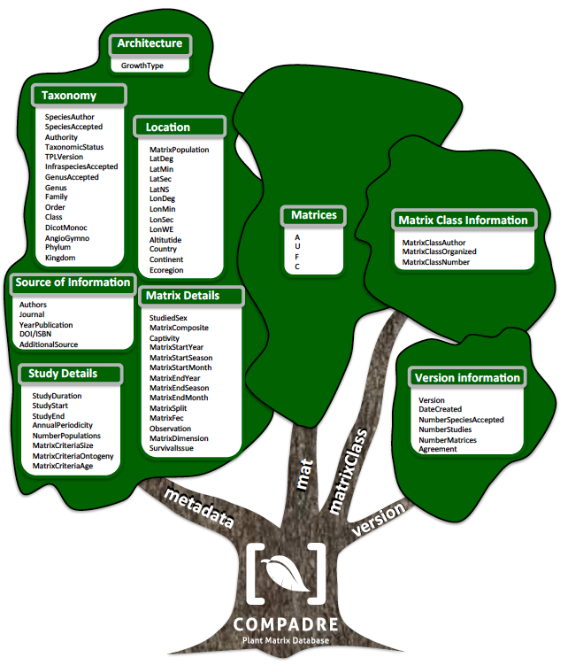

# User guide version information

Version 3.2.1

Date modified: `r format(Sys.time(), "%B %d %Y")`

Contact: compadre-contact@demogr.mpg.de

-------------
  

# General Instructions

## Database Organization

The data associated with COMPADRE are provided in a single R data object (extension .Rdata). In addition, these files are accompanied by R scripts and a nexus phylogeny available in the Supplementary Information of the manuscript introducing COMPADRE, and in our github repository (https://github.com/jonesor/compadreDB)

* COMPADRE_v_MAJOR_MINOR_PATCH.RData: Contains basic information regarding the source of publication, as well as ecological, biogeographic, and taxonomic details of the demographic study for each study species, the demographic information (i.e. the matrix population model) and metadata.

## The meanings of NA in COMPADRE

NA in the COMPADRE data generally means that the data are not available/applicable. This could be because the data were not reported by the author(s), or it could mean that the data have not yet been digitized for this version of COMPADRE. It could also mean that the data are not applicable in this case (e.g. where data are derived from several geographic locations we do not report a single average latitude/longitude value) 

## Disclaimer 

The COMPADRE digitization team does its best to ensure data accuracy, and every piece of information goes through multiple error-checks prior to its release in www.compadre-db.org. However, we claim no responsibility for any damage that may arise from using COMPADRE.  A list of error checks and potential issues in the use and interpretation of the database are described in the main manuscript. The end user is ultimately responsible for his/her interpretations of the data.

-----------------------------------------------

# What’s new in this version

### Version 3.2.1

  -  Added variable "Agreement" to branch "version"

### Version 3.2.0

  -	735 studies with 637 taxonomically accepted plant species and a total of 6,242 population matrix models
  -	Added variable MatrixFec and branch "version"
  -	Modified output of MatrixCriteriaSize, MatrixCriteriaAge and MatrixCriteriaAge to range “Yes” or “No” only
  -	Fixed typos (approx.. 0.01% of previous release) 

###  Version 3.0.0

-	474 studies with 670 (not taxonomically accepted necessarily –see SpeciesAuthor below) plant species and a total of 5,621 population matrix models. This version was previously named “COMPADRE_11_7_2014_version_03”.

-----------------------------------------------

**Figure 1.** *Variables archived in COMPADRE, organized according to the general category to which they are associated. The R data object `compadre` is a `list` containing further `list` and `data.frame` objects (named `metadata`, `mat`, `matrixClass` and `version`), here represented by each branch of the tree. The canopy contains the variables in each `data.frame`/`list`, organized by general categories.*

-----------------------------------------------

# Variables in `metadata`

The object `metadata` is a `data.frame` detailing the ancillary metadata that give context to each matrix population model (MPM).
These are detailed below.

### `SpeciesAuthor`

**Definition:** Latin name of the species as indicated in the publication; this may not be the same as the currently accepted name (See SpeciesAccepted below)

##### Possible values:

* `Genus_species` -	This variable always includes the genus and the species names and, where appropriate, information on variety and subspecies (see below).
If two or more demographic studies exist for a single species, these are digitized with a numeric suffix after Genus_species starting with “`2`” (e.g. “`Rosa_sempervirens`”, “`Rosa_sempervirens_2`”, “`Rosa_sempervirens_3`”). 

* `<…>var.<…>` -	Where the publication refers to an intraspecific variety, this is indicated with "`var.`" followed by the variety name, e.g. "`Pityopsis_aspera_var._aspera`"

* `<…>subsp.<…>` -	Where the study refers to an intraspecific subspecies, this is indicated with "`subsp.`" followed by the subspecies name, e.g. "`Anthyllis_vulneraria_subsp._alpicola`"

-----------------------------------------------

### `SpeciesAccepted`

**Definition:** Currently accepted latin name. This information is is obtained from The Plant List

##### Possible values:

* `<Genus_species>` -	e.g. Chorizanthe

-----------------------------------------------

### `Authority`

**Definition:** Taxonomic authority of SpeciesAccepted, as per  The Plant List

##### Possible values:

* `<Authority>` -	e.g. Benth.

-----------------------------------------------

### `TaxonomicStatus`

**Definition:** Taxonomic correspondence of SpeciesAuthor with SpeciesAccepted

##### Possible values:

* `NoMatch` -	Species is a plant, but it does not match with the data repository of The Plant List.

* `Unresolved` -	No match because species is not a plant (this is always the case with brown algae, Kingdom Chromalveolata)

* `Accepted` -	SpeciesAuthor is identical to SpeciesAccepted

* `Synonym` -	SpeciesAuthor is synonymous of SpeciesAccepted

-----------------------------------------------

### `TPLVersion`

**Definition:** Version of The Plant List used for taxonomic validation

##### Possible values:

* `1.0` -	Version 1.0

-----------------------------------------------

### `InfraspeciesAccepted`

**Definition:** Taxonomic infraspecific name of study SpeciesAccepted, as per The Plant List

##### Possible values:

* `<infraspecies>` -	e.g. pungens

-----------------------------------------------

### `SpeciesEpithetAccepted`

**Definition:** Taxonomic species epithet name of study SpeciesAccepted, as per The Plant List

##### Possible values:

* `<epithet>` -	e.g. pungens

-----------------------------------------------

### `GenusAccepted`

**Definition:** Taxonomic genus name of study SpeciesAccepted, as per The Plant List

##### Possible values:

* `<genus>` -	e.g. Chorizanthe

-----------------------------------------------

### `Genus`

**Definition:** Genus used in SpeciesAuthor

##### Possible values:

* `<genus>` -	e.g. Chorizanthe

-----------------------------------------------

### `Family`

**Definition:** Family to which species belongs

##### Possible values:

* `<family>` -	e.g. Polygonaceae

-----------------------------------------------

### `Order`

**Definition:** Order to which species belongs

##### Possible values:

* `order` -	e.g. Caryophyllales

-----------------------------------------------

### `Class`

**Definition:** Class to which species belongs

##### Possible values:

* `<class>` -	e.g. Magnoliopsida

-----------------------------------------------

### `DicotMonoc`

**Definition:** Whether species is a dicot or monocot

##### Possible values:

* `Eudicot` -	species is a dicot

* `Monocot` -	species is a monocot

* `NA` -	Species is neither a dicot nor a monocot (not an angiosperm)

-----------------------------------------------

### `AngioGymno`

**Definition:** Whether species is an angiosperm or a gymnosperm

##### Possible values:

* `Angiosperm` -	Species is an angiosperm

* `Gymnosperm` -	Species is a gymnosperm

* `NA` - Neither angiosperm nor gymnosperm

-----------------------------------------------

### `Phylum`

**Definition:** Phylum to which species belongs

##### Possible values:

* `<phylum>` -	e.g. Magnoliophyta

-----------------------------------------------

### `Kingdom`

**Definition:** Kingdom to which species belongs

##### Possible values:

* `kingdom` -	e.g. Plantae

-----------------------------------------------

### `GrowthType`

**Definition:** General plant/algae type, based mainly on architectural organization. The species was assigned to one of these possible values using the description of plant growth type provided by the author and other external sources (e.g. other publications)

##### Possible values:

* `Algae` -	A brown, green or red alga.

* `Annual` -	Typically plant ecologists also refer to pseudoannual species as being "biennials". The main difference between the annuals and biennials is that annual species complete their lifecycle (are born, grow, reproduce and die) within a single year, whereas biennials have the potential to stretch that time-window up to two years. Both annuals and biennials are often associated with periodic (or seasonal) matrices. Biennial (and pseudoannual) species are categorized as “Annual” in COMPADRE

* `Bryophyte` -	a bryophyte

* `Epiphyte` -	an epiphyte

* `Fern` -	a fern

* `Herbaceous perennial` -	a herbaceous perennial 

* `Liana` -	a liana

* `Palm` -	a palm

* `Shrub` -	a shrub

* `Succulent` -	a succulent

* `Tree` -	a tree

-----------------------------------------------

### `Authors`

**Definition:** Last (family) name of all authors

##### Possible values:

* `<name(s)>` -	Separated with “; ” e.g. "Smith; Jones"

-----------------------------------------------

### `Journal`

**Definition:** The document from which data were sourced.

##### Possible values:

* `<abbreviated journal name>` -	Where the data come from a scientific journal article, the abbreviated journal name is given. We use the standard abbreviation of the journal using the BIOSIS Format

* `Book` -	Matrices are from a book, or book chapter

* `PhD thesis` -	Matrices are from a doctoral thesis

* `MSc thesis` -	Matrices are from a masters thesis

* `Report` -	Matrices are from a report

* `Conference talk` -	Matrices are from a conference talk

* `Conference poster` -	Matrices are from a conference poster

-----------------------------------------------

### `YearPublication`

**Definition:** Year of publication

##### Possible values:

* `<yyyy>` -	e.g. 2012

-----------------------------------------------

### `DOI/ISBN`

**Definition:** Digital Object Identification or International Standard Book Number codes that identify the publication.

##### Possible values:

* `<DOI>` or `<ISBN>` -	e.g. "10.1111/1365-2745.12334"

-----------------------------------------------

### `AdditionalSource`

**Definition:** Additional source(s) used to reconstruct the matrix, or to obtain additional information on ancillary data

##### Possible values:

* `<Lastname Journal YearPublication>` -	e.g. Godinez-Alvarez Bot Rev 2003

-----------------------------------------------

### `StudyDuration`

**Definition:** The number of years of observation. This is calculated as (`StudyEnd` year - `StudyStart` year) + 1 (see below). The calculation thus overlooks any missing years in the middle of the study period

##### Possible values:

* `<integer>` -	e.g. 14

-----------------------------------------------

### `StudyStart`

**Definition:** First year of study

##### Possible values:

* `<yyyy>` -	e.g. 2012

-----------------------------------------------

### `StudyEnd`

**Definition:** Final year of study

##### Possible values:

* `<yyyy>` -	e.g. 2014

-----------------------------------------------

### `AnnualPeriodicity`

**Definition:** Indicates the time frame for which the seasonal or annual the MPM was constructed. e.g. 1 indicates that the MPM iteration period is 1yr; 2 indicates that the MPM iterates twice in a year; 0.2 indicates that the MPM iteration occurs every 5yrs.

##### Possible values:

* `<numeric value>` -	e.g. 1, 2, 0.2 etc.

-----------------------------------------------

### `NumberPopulations`

**Definition:** Number of populations of the study species. This variable refers to the number of populations as defined by the author. Within-site replication of permanent plots are not considered to be different populations (see below)

##### Possible values:

* `<integer>` -	e.g. 3 (for three populations)

-----------------------------------------------

### `MatrixCriteriaSize`

**Definition:** Indicates whether  the matrix  population model contains stages based on size, and if so, what variable of size was measured.

##### Possible values:

* `Yes` -	The matrix population model contains stages based on size (e.g. DBH, stem length, stem height, stem number, etc)

* `No` -	The matrix population model is not based on size

-----------------------------------------------

### `MatrixCriteriaOntogeny`

**Definition:** Indicates whether the matrix population model contains stages based on development. 

##### Possible values:

* `Yes` -	The matrix  population model contains at least one class that is based on development/ontogeny (e.g. seedbank, reproductive, vegetative, dormant, etc)

* `No` -	Matrix population model is not based on ontogeny

-----------------------------------------------

### `MatrixCriteriaAge`

**Definition:** Indicates whether the matrix population model contains any stage based on age

##### Possible values:

* `Yes` -	The matrix population model contains at least one class that is based on age (e.g. individuals of 0 year old)

* `No` -	The matrix population model is not based on age

-----------------------------------------------

### `MatrixPopulation`

**Definition:** Name of population where matrix was recorded, usually as given by the publication author. In some cases, where the author provides no name, we give the closest geographic location instead.  If there are multiple populations in the study and their names are not pertinent/available, sequential names in alphabetical order are assigned for each population in the study (e.g. “A”, “B”, “C”, etc)

##### Possible values:

* `<any text string>` -	e.g. “Brazeau Creek, Florida”. 

-----------------------------------------------

### `LatDeg`

**Definition:** Degree value of latitude.

##### Possible values:

* `<0-90>` -	e.g. 64

-----------------------------------------------

### `LatMin`

**Definition:** Minute value of latitude

##### Possible values:

* `<0-60>` -	e.g. 34

-----------------------------------------------

### `LatSec`

**Definition:** Seconds value of latitude (decimates are possible). Note that a value of `0` may mean that precise values are not available.

##### Possible values:

* `<0-60>` -	e.g. 23.14 or 34

-----------------------------------------------

### `LatNS`

**Definition:** Cardinal direction

##### Possible values:

* `N` -	North

* `S` -	South

-----------------------------------------------

### `LonDeg`

**Definition:** Degree value of longitude

##### Possible values:

* `<0-180>` -	e.g. 137

-----------------------------------------------

### `LonMin`

**Definition:** Minute value of longitude

##### Possible values:

* `<0-60>` -	e.g. 45

-----------------------------------------------

### `LonSec`

**Definition:** Seconds value of longitude (decimates are possible). Note that a value of `0` may mean that precise values are not available.
 

##### Possible values:

* `<0-60>` -	e.g. 34.335

-----------------------------------------------

### `LonWE`

**Definition:** Cardinal direction

##### Possible values:

* `W` -	West

* `E` -	East

-----------------------------------------------

### `Altitude`

**Definition:** Altitude of studied population defined as height above sea level of the population in meters.

##### Possible values:

* `<numeric value>` -	e.g. 653

-----------------------------------------------

### `Country`

**Definition:** Country/ies where study took place. We use ISO 3 three letter country codes (https://en.wikipedia.org/wiki/ISO_3166-1_alpha-3). If the study involves multiple countries, these are separated by "; ". 

##### Possible values:

* `<ISO 3 country code(s)>` -	e.g. `DEU; DNK` for a study carried out in Germany and Denmark.

-----------------------------------------------

### `Continent`

**Definition:** Continent where study took place

##### Possible values:

* `Africa` - 

* `Asia` -	

* `Europe` -	

* `N America` -	Includes Canada, USA & Mexico

* `S America` -	Countries in the Americas except Canada, USA and Mexico

* `Oceania` -	Various definitions for Oceania exist, but here we opted for this one: http://en.wikipedia.org/wiki/List_of_Oceanian_countries_by_population 

-----------------------------------------------

### `Ecoregion`

**Definition:** Indication of the ecoregion for the study, using the categories described in Figure 1 of Olson et al. (2001).  For a more inclusive description of water ecoregions, see http://worldwildlife.org/biomes The one exception for this is the code `LAB` used for studies conducted in laboratory or greenhouse conditions.

##### Possible values:

* `TMB` - Terrestrial - tropical and subtropical moist broadleaf forests

* `TDB` - Terrestrial - tropical and subtropical dry broadleaf forests

* `TSC` - Terrestrial - tropical and subtropical coniferous forests

* `TBM` - Terrestrial - temperate broadleaf and mixed forests

* `TCF` - Terrestrial - temperate coniferous forests

* `BOR` - Terrestrial - boreal forests/ taiga

* `TGV` - Terrestrial - tropical and subtropical grasslands, savannas and shrublands

* `TGS` - Terrestrial - temperate grasslands, savannas, and shrublands

* `FGS` - Terrestrial - flooded grasslands and savannas

* `MON` - Terrestrial - montane grasslands and shrublands

* `TUN` - Terrestrial – tundra

* `MED` - Terrestrial - Mediterranean forests, woodlands and scrubs

* `DES` - Terrestrial - deserts and xeric shrublands

* `MAN` - Terrestrial – mangroves

* `LRE` - Freshwater - large river ecosystems

* `LRH` - Freshwater - large river headwater ecosystems

* `LRD` - Freshwater - large river delta ecosystems

* `SRE` - Freshwater - small river ecosystems

* `SLE` - Freshwater - small lake ecosystems

* `LLE` - Freshwater - large lake ecosystems

* `XBE` - Freshwater - xeric basin ecosystems

* `POE` - Marine - polar ecosystems

* `TSS` - Marine - temperate shelf and seas ecosystems

* `TEU` - Marine - temperate upwellings

* `TRU` - Marine -tropical upwellings

* `TRC` - Marine - tropical coral

* `LAB` - Laboratory or greenhouse conditions – controlled, usually indoor, conditions that mean the study species is not affected by the environment conditions typical of the actual geographic location of the study 

-----------------------------------------------

### `StudiedSex`

**Definition:** 

##### Possible values:

* `M` -	Studied only males

* `F` -	Studied only females

* `H` -	Studied hermaphrodites

* `M/F` -	Males and females separately in the same population matrix model

* `A` -	All sexes modeled together

-----------------------------------------------

### `MatrixComposite`

**Definition:** Indicates the type of matrix population model (also see Figure 2 below for more information).

##### Possible values:

* `Individual` -	A matrix population model constructed for a single study × species × population × treatment × period combination.

* `Mean` -	An average (mean) of other matrix population models (e.g. element-by-element arithmetic mean of a population's matrices across several time periods available).

* `Pooled` -	A matrix population model that has been constructed by pooling individual-level demographic information across populations and/or periods. This type of matrix, when available, has always been provided by the author either in the publication or through personal communications.

* `Seasonal` -	A matrix population model that does not describe a full annual transition, but rather a seasonal (< 1 yr) transition.

-----------------------------------------------

### `MatrixTreatment`

**Definition:** Describes if a treatment was applied or not and the nature of the treatment.

##### Possible values:

* `<treatment>` -	A brief description of the treatment applied to the population described by the matrix population model. We define treatment as an action intentionally imposed by humans.  If more than one applies to a matrix, treatments are separated with a “; ”

* `Unmanipulated` -	No experimental, human-imposed treatment was applied. Natural events of non-intentional occurrence (e.g. fire, hurricanes) are recorded as “Unmanipulated”, but these incidences are described in the “Observations” variable (below)

-----------------------------------------------

### `Captivity`

**Definition:** Whether the study species was studied in the wild or under controlled conditions for most of its life cycle

##### Possible values:

* `W` -	Wild: study in natural conditions

* `C` -	Captive: studied for most part of the life cycle of the species in a botanical garden, green house, laboratory, etc.

* `CW` -	Captured from Wild: If the species was taken from a wild population but studied in labs or gardens etc.

-----------------------------------------------

### `MatrixStartYear`

**Definition:** First year of study. Year `t` in annual matrix population model that describes population dynamics from time `t` to `t+1`.

##### Possible values:

* `<yyyy>` -	e.g. 1994

-----------------------------------------------

### `MatrixStartSeason`

**Definition:** First season of study. Season `s` in periodic matrix population model that describes population dynamics from season `s` to `s+1`. Seasons are naturally hemisphere-specific, and this information can be deduced from variables `Country` and `LatDeg`, below. Here season is used as described in manuscript by the authors (summer in the southern hemisphere corresponds to Winter in the northern hemisphere).

##### Possible values:

* `1` -	Spring

* `2` -	Summer

* `3` -	Autumn/Fall

* `4` -	Winter

-----------------------------------------------

### `MatrixStartMonth`

**Definition:** First month of study.

##### Possible values:

* `<1-12>` -	e.g. 1 = January, 6= June etc.

-----------------------------------------------

### `MatrixEndYear`

**Definition:** Last year of study. Year `t+1` in matrix population model that describes population dynamics from time `t` to `t+1`.

##### Possible values:

* `<yyyy>` -	e.g. 1999

-----------------------------------------------

### `MatrixEndSeason`

**Definition:** Last season of study. Season s+1 in periodic matrix population model that describes population dynamics from season s to s+1. Here season is used as described in manuscript by the authors (Summer in the Southern Hemisphere corresponds to Winter in the Northern Hemisphere)

##### Possible values:

* `1` -	Spring

* `2` -	Summer

* `3` -	Autumn/Fall

* `4` -	Winter

-----------------------------------------------

### `MatrixEndMonth`

**Definition:** Last month of study.

##### Possible values:

* `<1-12>` -	e.g. 1 = January, 6= June etc.

-----------------------------------------------

### `MatrixSplit`

**Definition:** This indicates whether the MPM **A** matrix has been divided into its constituent **U**, **F** and **C** submatrices. See Figure 3 below for further details.

##### Possible values:

* `Divided` -	The matrix population model **A** has been been divided into the process-based submatrices **U**, **F** and **C**.

* `Indivisible` -	The matrix population model **A** has **not** been divided into the process-based sub-matrices **U**, **F** and **C** because insufficient information is available to classify the various demographic processes for each sub-matrix. In indivisible matrices, only **A** has values given - the other matrices are filled with **NA** values.

-----------------------------------------------

### `MatrixFec`

**Definition:** This records whether fecundity was measured at all for this matrix model.  

The rationale for this is that a fecundity (in the F matrix) may be recorded as 0 either because it was not measured, or because reproduction was measured and estimated to be zero. As a general rule, if any values for fecundity (e.g. in the F matrix) are non-zero, then MatrixFec should be recorded as 'Yes'. If all values are zero, then you we check the paper carefully to check whther this is because no fecundity was detected, or whether no attempt was made to measure fecundity.

##### Possible values:

* `Yes` -	Reproduction was included in the MPM, and thus values >0 should appear in the submatrix **F** if sexual reproduction occurred in these stages/ages. Note that it is possible that reproduction was measured and modelled but none occurred. In that case, values of 0 are possible in the F matrix.

* `No` -	Reproduction was not modelled by the matrix population model, either because it was not the goal of the study or due to logistical impossibility. In some **F** submatrices the elements where sexual reproduction would have appeared contain NA values, and in others they contain 0 values.

* NA - it is not known whether fecundity was measured for the matrix

-----------------------------------------------

### `Observation`

**Definition:**  This variable provides information that is not provided elsewhere but may nonetheless be important (e.g. plant canopy, burning intervals, etc.)

##### Possible values:

* `<any text>` - any text string giving useful additional information.

-----------------------------------------------

### `MatrixDimension`

**Definition:** Dimension of the matrix population model **A**.

##### Possible values:

* `<integer>` -	e.g. 5

-----------------------------------------------

### `SurvivalIssue`

**Definition:** Minimum stage-specific survival value in the matrix population model submatrix **U** when > 1

##### Possible values:

* `<numeric>` -	e.g. 0.9, 1.2, 1.45

-----------------------------------------------

# Variables in `matrixClass` 

The object `matrixClass` is a `list` of `data.frame`s detailing the class names used in each MPM. 

### `MatrixClassAuthor`

**Definition:** The stage description as indicated in the source by the publication author of the matrix population model. When possible, we add units (e.g. cm, m, cm^2^).

-----------------------------------------------

### `MatrixClassOrganized`

**Definition:** We standardize all stages in a given population matrix model to one of three stages (prop, active, dorm) to facilitate analyses. 

##### Possible values:

* `prop` -	Propagule (seed). This applies to every stage defined by the author as seed bank or seed. Users are encouraged to carefully examine matrices with these stages and to implement the appropriate calculations to avoid a spurious additional year being added when no seedbank exists in the study species, as explained by Caswell (2001, p. 60).

* `active` - This includes stages that can neither be placed in the  `prop` nor  `dorm` (see below) stages.

* `dorm` -	A stage that is vegetatively dormant after having germinated and becoming established.

-----------------------------------------------

### `MatrixClassNumber`

**Definition:** A numerical representation of classes in the population matrix model. 

##### Possible values:

* `<integer>` -	e.g. `1,2,3, ... n`, where `n` is the dimension of the MPM (see `MatrixDimension` below)

-----------------------------------------------

# Variables in `mat` 

The object `mat` is a `list` of `list`s giving the actual MPMs in the form of the **A** matrix, and (where possible), the  **U**, **F** and **C** matrices.

### `matA`

**Description:** The matrix population model **A** which describes the population dynamics of a population under conditions described by `MatrixComposite`, `MatrixTreatment`, `MatrixStartYear`, `MatrixEndYear`, `Population`, and `Observation` in the `metadata` object.

-----------------------------------------------

### `matU`

**Description:** The population sub-matrix model **U** (a sub-matrix of **A**), which describes the survival-dependent dynamics of a population under the conditions described above. A range of numeric values are possible, but are constrained to be between 0 and 1. These include only survival-dependent vital rates (no sexual or clonal reproduction). The values are only digitized for `Divided` matrices (indicated by variable `MatrixSplit`)

-----------------------------------------------

### `matF`

**Description:** The population sub-matrix model **F** (a sub-matrix of **A**), which describes the sexual-reproduction dynamics of a population under the conditions described above. A range of numeric values are possible, but are constrained to be positive. These include only estimates of sexual reproduction (no clonal reproduction). 

The values are only digitized for `Divided` matrices (indicated by variable `MatrixSplit`)

-----------------------------------------------

### `matC`

**Description:** The population sub-matrix model **C** (a sub-matrix of **A**), which describes the clonal-reproduction dynamics of a population under the conditions described above. A range of numeric values are possible, but these are constrained to be positive. These include only estimates of clonal reproduction. 

The values are only digitized for `Divided` matrices (indicated by variable `MatrixSplit`)
	

-----------------------------------------------

# Variables in `version`

`version` is a `list` that provides some summary information.

### `Version`

**Description:** The version number of the database (Major_Minor_Patch). Past versions include: 3.0.0. Current version is 3.1.0. Numbering follows semantic versioning (www.semver.org). 

-----------------------------------------------

### `DateCreated`

**Description:** Date of creation of the `Rdata` database object in the format `MMM_DD_YYYY`. E.g. Aug_06_2015.

-----------------------------------------------

### `NumberAcceptedSpecies`

**Description:** Total number of taxonomically accepted species. The total number of accepted species is based on variable `SpeciesAccepted` (above). E.g. 637

-----------------------------------------------

### `NumberStudies`

**Description:** Total number of species × studies in the database. e.g. 735

-----------------------------------------------

### `NumberMatrices`

**Description:** Total number of matrices (not including split matrices **U**, **F** and **C**) in the database.

-----------------------------------------------

### `Agreement`

**Description:** Link to the URL in the COMPADRE database containing the open-access conditions to the use of these data: http://www.compadre-db.org/Compadre/UserAgreement.

-----------------------------------------------

# Appendix - The calculation of mean matrix population models

*	In COMPADRE we present the individual matrix population models for each season, year, study population and treatment that can be calculated from a paper, as well as those personally communicated by the publication authors to the COMPADRE digitization team.  When pertinent, mean matrix population models that are element-by-element averages (arithmetic mean) across all Unmanipulated matrix population models (defined above) and across each treatment group are also given. Mean matrix population models that combine estimates from different treatments, or that combine estimates from treatments with unmanipulated conditions, are not calculated because of their lack of biological interpretation (Figure 2).

*	Seasonal matrix population models, where more than one matrix  population model exists for a single year, are marked as “Seasonal”.  For these, we calculate average matrix population models for each season but not for each year (Figure 3). Deriving an annual model from  seasonal data is straightforward and the calculations are described by Caswell (2001, p. 349).

-------------------------------------------

**Figure 2.** *Schematic showing how mean population matrix models are derived from all available population matrix models in a study.* **A.** *For annual population matrix models (those that follow population dynamics from one year to the next, or sometimes more – some tree species are studied with a 5-year interval), element-by-element means are first calculated across the population matrix models describing the population dynamics for time periods within each population. Then the grand element-by-element mean is calculated across the matrix population models for the different populations. This procedure is repeated for models describing dynamics under each imposed treatment (pink matrices below) and for those describing the dynamics of unmanipulated populations (gray). Note that mean population matrix models are only calculated from population matrix models that share the same treatment (or absence of treatment).* **B.** *For seasonal or periodic population matrix models (e.g. for annual species), the mean seasonal population matrix model is calculated within populations and then across populations, both for matrices describing treated populations and for those describing populations with no imposed treatment (i.e. unmanipulated).*

**Figure 3.** *Life cycle of two hypothetical plant populations based on age* (**A**) *and size* (**B**)*, with their corresponding matrix population models A, and underlying basic demographic processes of survival (U sub-matrix; solid arrows), sexual reproduction (F sub-matrix; dashed arrows) and clonal reproduction (C sub-matrix; dotted arrows). In the Leslie matrix model example* (**A**) *, the division of sub-matrices is more straightforward than in the Lefkovitch matrix model example * (**B**)*. In the latter imaginary example, individuals can transition into the same stage as they can contribute with sexual and/or clonal offspring (e.g. small stage). In these cases, splitting A into sub-matrices U, F and C is only feasible when sufficient information is provided by the authors (see variable `MatrixSplit` in above). *

-----------------------

# References

Caswell, H. (2001) *Matrix population models*. Second edition. Sunderland, MA: Sinauer Associates.

Olson, D.M., Dinerstein, E., Wikramanayake, E.D., Burgess, N.D., Powell, G.V., Underwood, E.C., D’amico, J.A., Itoua, I., Strand, H.E. & Morrison, J.C. (2001) Terrestrial Ecoregions of the World: A New Map of Life on Earth A new global map of terrestrial ecoregions provides an innovative tool for conserving biodiversity. *BioScience*, 51, 933–938.

