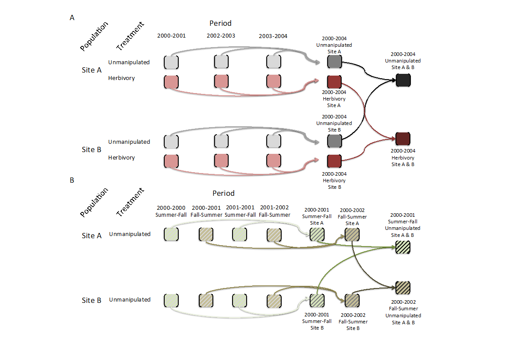
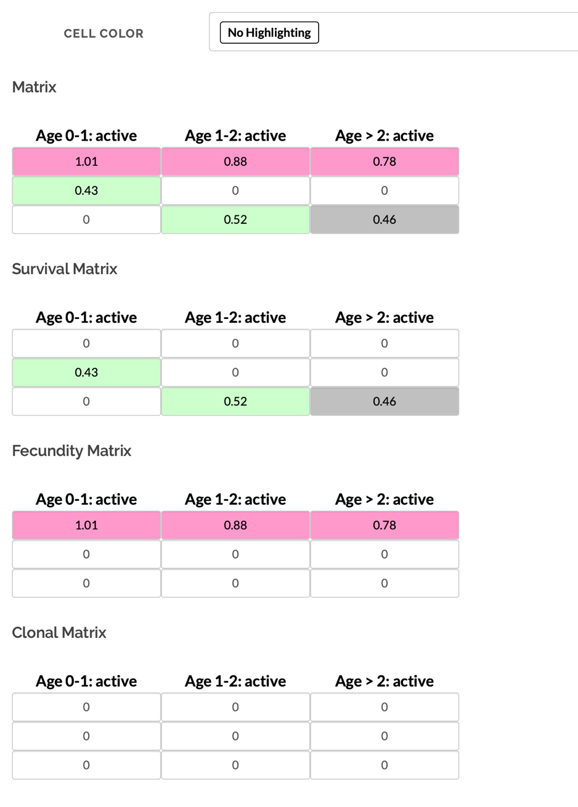
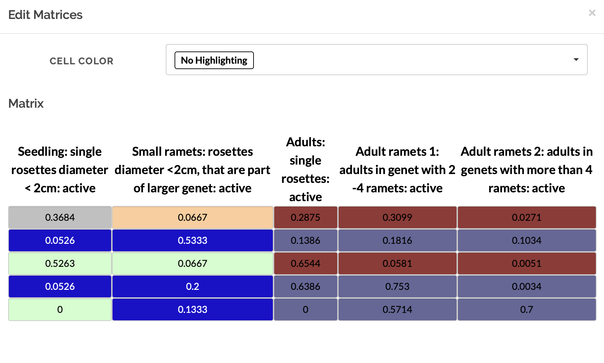
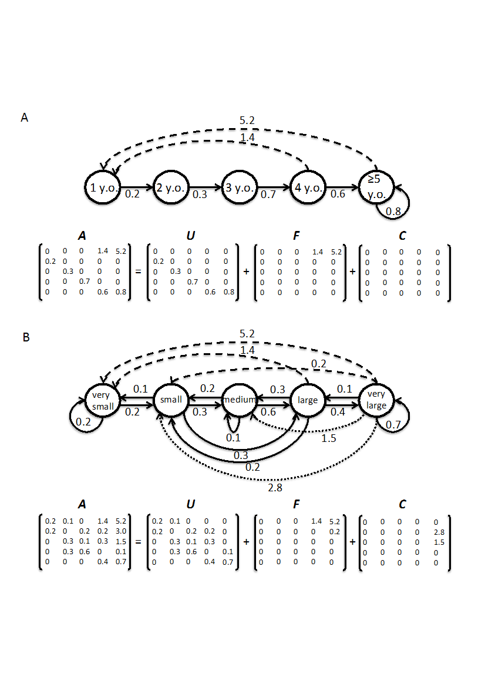

## Preamble

The COMPADRE Plant Matrix Database (COMPADRE hereafter) and the COMADRE Animal Matrix Database (COMADRE hereafter) are compiled from (mostly) published literature. The majority of this literature was published as peer-reviewed articles in academic journals, with a smaller number of data obtained from books, conference presentations, etc.

The data digitisation team (The COMPADRinos) carefully examine the literature and extract information in order to reconstruct the matrix population models analysed by the original researchers. The extracted data are entered into our web-based digitization forms, which are then stored as structured SQL tables. Wherever there are doubts about aspects of the data source, the team attempts to contact the researchers to resolve them. There are three types of digitization forms in COMPADRE/COMADRE: (1) The PUBLICATION form which contains metadata on the publication, such as bibliographic and study level information; (2) The POPULATION form with metadata that allows for the interpretation of the matrix data, and it pertains to information at the species/population level; and (3) the MATRIX form, which contain the matrix population models themselves, as well as information that is matrix-specific.

These data are compiled using a set of R scripts and released to the public as open access data via the website: www.compadre-db.org.

This document outlines the way that the digitisation team enters data into our website. It is primarily intended for internal use and, as such, it includes information on some variables which are not released into the public domain. Nevertheless, following our philosophy on open access, replicability and transparency, we provide open access to the document here. Users external to our team with questions can direct them at compadrecontact@gmail.com. Specific questions can also be directed to Rob Salguero-Gómez (rob.salguero@zoo.ox.ac.uk) or Owen Jones (jones@biology.sdu.dk).

## General information

* If you find additional sources **always** attach them and note them in “Additional Source”. An additional source is a paper that references matrices from another source already in the database. 

* Download the PDF attached to the publication form assigned to you, all pieces of information extracted from PDFs must be highlighted directly on the PDF in yellow and re-upload the PDF to the publication form.

* If a PDF contains matrices/data from other papers and/or studies, this must be noted as “Not primary source” in the notes variable of the publication form.

* If additional publications are found with respect to a given species, these must be inspected for any additional matrix population models with different model assumptions (e.g. different stages) and/or different study years, populations and/or treatments. If the paper provides new information, it must be included in the database as a new publication.

* Authors must only be contacted from the official email: compadrecontact@gmail.com.

* Where matrices can be split, please always include an “A” matrix as well as “U”, “F” & “C” matrices (for explanation see here in the protocol for matrix form). Present matrices from left-to-right in the order A, U, F, C. **Always** split matrices when possible.

* There are also species that do not fall into the Kingdoms Plantae or Animalia. Fungi and Algae should be included in COMPADRE, with the plants. Any other species (e.g. bacteria) should be included in COMADRE.

******

## Values used throughout the database

The following values are commonly used throughout the database.

**NA** - Not available - The information is not available either because the author does not have it or because the information is not recognized as “priority” (see below) for the digitisation.

**AFI** - Asked for it - The information is not yet in the database, but the COMPADRino has already contacted the author requesting it (i.e. the author has not yet replied).

**NDY** - Not digitised yet - The information has not yet been digitised. This is likely to occur when some priority information has been digitised for a given species, and the COMPADRino has moved onto another species without contacting an author for the missing information.

**NC** - Not calculated - Information was not calculated because its calculation is not sensible. For instance, latitudes and longitudes of various populations of the same species are not averaged and assigned to the grand-mean population matrix of the species. This is the same for ranges, where author provides a range of latitudes and longitudes for a given population. Ranges are instead noted in the observation column.

**LAB** - Laboratory - The author collected demographic data for the studied species in a laboratory or under greenhouse conditions. Controlled, typically indoor, conditions that mean the study population is not affected by the environmental conditions typical of the **actual** geographic location of the study.

**FRANK** - Frankenstein matrix - Frankenstein matrices are MPMs where the author parameterised their model using demographic data from 2+ other papers/sources; in other words, when the matrix values come from a source that was not affected by the same conditions as the rest of the matrix. These MPMs should be clearly indicated with “`FRANK`” in the observation column. Furthermore, geographic location data, time information (start/end year, season etc.) should be recorded only if the author reports **one** main location for the matrix; if multiple locations are reported, then it should be recorded as `FRANK` and not `NA`.

**Simulation** - A simulated matrix - The matrix model is a simulation, and perhaps only loosely based on a specific real species. Typically, these simulated matrices are used to explore the behaviour of a population in a theoretical way. In those cases, there is no geographic location, ecoregion etc. For these data we do not calculate averages or ranges for locations and time periods but instead enter `Simulation` (not `NA`).

************************************************
## Important References

* Caswell, H. (2001) Matrix population models. Second Edition. Sunderland, MA: Sinauer Associates.

* Olson, D.M., Dinerstein, E., Wikramanayake, E.D., Burgess, N.D., Powell, G.V., Underwood, E.C., D’amico, J.A., Itoua, I., Strand, H.E. & Morrison, J.C. (2001) Terrestrial Ecoregions of the World: A New Map of Life on Earth A new global map of terrestrial ecoregions provides an innovative tool for conserving biodiversity. BioScience, 51, 933–938.

* Salguero-Gómez, R., Jones, O. R., Archer, C. R., Buckley, Y. M., Che-Castaldo, J., Caswell, H., Hodgson, D., Scheuerlein, A., Conde, D. A., Brinks, E., de Buhr, H., Farack, C., Gottschalk, F., Hartmann, A., Henning, A., Hoppe, G., Römer, G., Runge, J., Ruoff, T., Wille, J., Zeh, S., Davison, R., Vieregg, D., Baudisch, A., Altwegg, R., Colchero, F., Dong, M., de Kroon, H., Lebreton, J.-D., Metcalf, C. J. E., Neel, M. M., Parker, I. M., Takada, T., Valverde, T., Vélez-Espino, L. A., Wardle, G. M., Franco, M., Vaupel, J. W. (2015), The COMPADRE Plant Matrix Database: an open online repository for plant demography. Journal of Ecology, 103: 202–218. doi: 10.1111/1365-2745.12334

************************************************
# Protocol for the publication form

## Status

This is the status for the publication. Please READ the website-status protocol to determine the status that should be assigned to the publication. 

* Assigned – the publication has been assigned to a node. The compadrino will get publications in this status. Once the compadrino has started working on the publication, it should be changed to “Digitizing”

* Digitizing – compadrino is working/editing the population

* Rejected/Deleted

* Awaiting info – compadrino has determined s/he requires more information to complete digitization

* Review-Ready – the population is ready to be reviewed by a database curator

* Released – population can be now seen by public users

* Error – an error has been found in the population and needs to be corrected

## Node Assignment

The node the publication has been assigned for. Only coordinators and Admins edit this field.

## Assigned to

The name of the compadrino that has claimed or has been assigned the publication.

## Database

The database to which the publication belongs to, either Compadre (plants) or Comadre (animals). Usually determined by the database coordinator. When you are assigned a publication, always make sure the assigned database is correct.

* Compadre (plants)

* Comadre (animals)

## Attach a document

Attach all files used to digitize this publication. Include original journal article, additional sources, appendices, files from author communications, etc. Usually all proposed/assigned publication will have attached the original journal article. 

## DOI/ISBN

The DOI of the journal article. If you have the DOI, you could automatically fill the bibliographic information fields. Check to make sure those fields were populated correctly.

## Authors

Publication authors. This is usually done by the database coordinator. Make sure all authors have been added and are in the right order. If an author is missing search for the last name in the search box; make sure to select the correct author. If the author is not in the list, use the button “Create author” to add a new one:

* Author name: The last name of the author.

* Author initials: The initials of the first, middle and other names of the author, do not include the last name initials.

* Author email: if it is the corresponding author, include the contact email. 

## Reference type

Record the type of reference from which data were sourced. 

* Book: Matrices are from a book

* Book Chapter: Matrices are from a single chapter in a book

* Journal Article: Matrices come from a Journal paper

* Journal name: Record the standard abbreviation of the journal using the BIOSIS format. For journal abbreviations, click “Full list of journal abbreviation” above. If no abbreviation is available in the list, search past records of the journal from the website or look for it in the left corner of the paper. Full list of journal abbreviation with link (https://images.webofknowledge.com/images/help/WOS/A_abrvjt.html) should be moved to under journal name (currently it’s under reference type”)

* Year: the year the paper was published.

* Thesis: Matrices are from a thesis such as PhD thesis, MSc thesis, etc.

* Thesis type: Select the correct option.

* Report: Matrices are from a report.

* Conference: Matrices are from a conference in forms such as a talk or a poster.

* Others: Matrices are from other sources including, but not limited to archives.

## Purposes

Select all that apply. Describes the purpose(s) of the study detailed in the manuscript. This information is usually obvious from the abstract and the last paragraph of the introduction. Several purposes are possible per study.

We have categorised the purposes as follows:

* Comparative demography - When the authors studied two or more species

* Spatial demography - When the authors studied the demography of two or more populations within the same species

* Abiotic impacts - When the authors studied the effects of abiotic factors (e.g fire, hurricanes, rain, fertilisers, droughts, etc)

* PVA - When the authors report a Population Viability Analysis of an endangered species

* Species dynamics description - When there is no actual treatment in the study (Unmanipulated). Instead, the goal was to describe the natural dynamics of a species

* Interspecific interactions - When the authors studied the interactions between different species (e.g herbivory, pollinators, inter-specific competition, predation, parasitism, etc)

* Management evaluation - When the authors explored the effects of a specific management plan (e.g. to eradicate an invasive species, to preserve an endangered species or assess effects of management on other species).

* Methodological advancement - When the novelty of the paper is not an ecological question, but mostly to introduce a new mathematical tool often using already published matrices.

## Embargo

If the author does not wish to make personally communicated data available, the data will be under embargo until this date. On that date, an automatic reminder will go out to assigned Compadrino, Admin and Coordinator. The data will not become public until explicit permission has been given by the author. Update the embargo date if the author sets a new date. Leave blank when there is no embargo.

## Additional source

Record all additional sources used to construct matrices or to obtain additional ancillary data. Additional sources should be formatted as LastName Journal YearPublished additional information (e.g. Godinez-Alvarez Bot Rev 2003, Schmidt J Ecol 2007 Appendix A1) both here and in the attached file names. Be sure to update both whenever changes are made to the data associated with the publication. Attach the necessary PDF/excel files/documents to the “Attach a document” field. 

## Additional Notes

This field is intended to record any important issues or general notes about the data for the use of the COMPADRINO team. These entries should only include sensible informative key points that others can understand. Use English only.

## Missing data

Data that is not yet available and thus not yet digitized for this publication. Update this information whenever changes are made to populations and matrices associated with this publication. 

## Treatment

Record all treatment categories used in the study. Include both environmental and experimental treatments. Write “No” if nothing was manipulated. 

## Within Site Replication

Number of plots or transects sampled at each population and the size description of the plots. For example, 6(4x4m^2) means that in each population, there were 6 permanent plots of 4x4m2. If different populations have different plot sizes, record all of them separated by semicolon. (e.g. A: 2(15ha); B: 3(20ha))

## Study start (year)/ Study End (year)

An alert will appear if the start year is greater than the end year, or if the year recorded is greater than 2020 

## Release version

The Version number of the database where the data were released (no longer applies). Do not enter anything here.

## Database source

The institute that collated the data together in a mini database before COMPADRE and COMADRE were developed. 
Under “Author contacts” tab

Add one or more authors. Use “Add author contact” button to add all the authors that falls into the following categories:

* The corresponding author of the publication 

* Other authors contacted when the corresponding author of the study was unreachable 

* The authors were referred to by the corresponding author

* Authors of additional sources contacted for information

## Corresponding author

Select the corresponding author from the list of the authors in the bibliographic information. If the author is not added into the database yet, click “Create New Author” to add a new author.

**Create New Author** and **Add New Author** buttons

Author email: If the email of the author is provided, add the email address

**Edit author** button in Manage Authors tab

Update the contact information of the author. Put year or “dead” in parentheses to keep track of multiple emails. (e.g. aaa@compadre.org (dead); aaa@compadre.org (2016); xxx@compadre.org (2019))

## Date contacted

Record the date(s) when the publication author was contacted asking for information in US date format (mm/dd/yyyy). Authors should always be contacted from the compadrecontact@gmail.com email address rather than a personal email address.

Procedure for lack of response depends on the Year of Publication of the source:

* For papers older than 1990: When the corresponding author does not reply to your third email, or you cannot find their email address (e.g. in old publication) or reach their coauthors, then change the publication status from “Digitizing” to “Review-ready.”

* For more recent papers (published after 1990): If the authors (and coauthors) do not reply after the third time you have contacted them, please pass the email address that you have sent them, together with a brief summary of the information you are after and the attached PDF to Owen and Rob. If they do not make successful contact with the authors, they will change the publication status from “Digitizing” to “Review-ready.”

If you were not able to find an email address of any of the authors of a paper (and also Rob and Owen don’t know one), but that paper has a matrix population model that can be digitised – enter the matrix and all information that are available from the paper. All missing information get an NA and we list the species as “Review-Ready”, still enter the missing information into Missing Data field.

## Date contacted again

Date(s) of the other attempts to contact this corresponding author. (mm/dd/yyyy; mm/dd/yyyy). Make another attempt to contact the author again if there has not been a response in 3 months.

## Sent email content

This records the information that was requested from the author. Use the same format as for “Missing Data” above. If multiple pieces of information are requested, separate with “;”. If the author has been asked for something other than the standard missing information, a short note should be left, e.g. “is the species clonal?”

## Author’s reply email content

Did the author reply to a request for further information. This should record a brief answer given by the author, or “No” (no response yet). Note: Always change **Author’s Reply** from “NA”" / “Nothing” to “No” when author has been contacted and update the entry as soon as a reply is received. Always reply to the author with a short thank-you note when a reply is received.

Change it to the codes from “Missing Data” (M; I; L; S; O) when the information was received from the author. If the author has been asked for information other than the standard information, make a short note of what it is. Also, record the date author replied next to the information received. (e.g. M; S (11/11/2018))

# Protocol for the Population form

## Status

This is the status for the population. Please READ the website-status protocol to determine the status that should be assigned to the population. 

* Digitizing – compadrino is working/editing the population

* Rejected/Deleted

* Awaiting info – compadrino has determined s/he requires more information to complete digitization

* Review-Ready – the population is ready to be reviewed by a database curator

* Released – population can be now seen by public users

* Error – an error has been found in the population and needs to be corrected

## Species Accepted

Currently accepted Latin binomial name for the species. 
Search for the correct species name. This might be different from the Latin name the author used (e.g. author used an old Latin name for the species). If you cannot find the correct species name in this field contact a website Admin.

## Species Author

The Latin binomial name of the species as reported in the publication. Note that this may not be the same as the current accepted name. If an author uses a Latin name with a typo, please leave it as is, as this variable represents the name as used by the authors. This applies, as well, if the author(s) used an outdated taxonomic name

* Record as Genus_species. 

* When intra-specific names are given by authors, record them as Genus_species_subsp._subspecies, Genus_species_var._variety, or Genus_species_cf._colour form. (e.g. Sarracenia_alata, Sambucus_racemosa_subsp._sieboldiana)

* Always use an underscore “_" to substitute spaces (e.g. write “Cryptantha_flava” instead of “Cryptantha flava”). This only applies to the Species Author field

## Population name

The name of the population where the data for the matrix was recorded. Usually given by the author. When no name provided, use other characteristic information, such as a brief geographic location. If there are multiple populations in the study and their names are not pertinent/available, sequential names in alphabetical order are assigned for each population in the study.

## Species common name

The common name for the species. This is pulled automatically from the selected species but can be overwritten if desired/needed.

## Ecoregion

Description of the Ecoregion for the study. Follow the link to obtain the ecoregion for the set of coordinates the population is located in: https://patrickbarks.shinyapps.io/biomes/ 

The options are:

**Terrestrial ecoregions**

* TMB tropical and subtropical moist broadleaf forests

* TDB tropical and subtropical dry broadleaf forests

* TSC tropical and subtropical coniferous forests

* TBM temperate broadleaf and mixed forests

* TCF temperate coniferous forests

* BOR boreal forests/ taiga

* TGV tropical and subtropical grasslands, savannas and shrublands

* TGS temperate grasslands, savannas, and shrublands

* FGS flooded grasslands and savannas

* MON montane grasslands and shrublands

* TUN tundra

* MED Mediterranean forests, woodlands and scrubs

* DES deserts and xeric shrublands

* MAN mangroves

**Freshwater ecoregions**

* LRE large river ecosystems

* LRH large river headwater ecosystems

* LRD large river delta ecosystems

* SRE small river ecosystems

* SLE small lake ecosystems

* LLE large lake ecosystems

* XBE xeric basin ecosystems

**Marine ecoregions** 

* POE polar ecosystems

* TSS temperate shelf and seas ecosystems

* TEU temperate upwellings

* TRU tropical upwellings

* TRC tropical coral

For a more inclusive description of water ecoregions, see http://worldwildlife.org/biomes

## Country

Choose the ISO 3 Country Code(s) of where the study took place. You can search by the country’s name or the country’s code.

## Population nautical miles

For oceanic studies, this is the distance in nautical miles from the closest land mass. If the population was studied both in French and Spanish waters 22 miles from land the country code field would be FRA; SPA and the nautical miles field would be NODC-22. If it was only studied in international waters (normally defined as 12 nautical miles) then you would record it as NODC-22.

## Continent

Continent where study took place. Select the appropriate one:

* Africa

* Asia

* Europe

* N America (includes Canada, USA and Mexico)

* S America (includes the rest of the countries in the Americas not outlined in “N America”)

* Antarctica

* Oceania (various definitions for Oceania exist, but here we opted for this one: https://en.wikipedia.org/wiki/List_of_Oceanian_countries_by_population)

## Matrix criteria size

Records whether the matrix model is based on size (e.g. stem length/number, body length/mass, etc).

* Yes - The matrix population model contains stages based on size.

* No - The matrix population model is not based on size.

## Matrix Criteria Ontogeny

Records whether the matrix model is based on ontogenetic stage (e.g. seedbank, reproductive, vegetative, dormant, etc).

* Yes - The matrix population model contains at least one class that is based on development/ontogeny (e.g. seedbank, reproductive, vegetative, dormant, etc).

* No - Matrix population model is not based on ontogeny.

## Matrix Criteria Age

Records whether there are any classes that are based on age.

* Yes - The matrix population model contains at least one class that is based on age (e.g. individuals of 0 year old)

* No - The matrix population model is not based on age

## Coordinates and Altitude

Get coordinates from https://www.gps-coordinates.net/ 

Estimate the geographic coordinates to the nearest location possible. Check if they reasonably fit the location of the study by looking them up on Google maps or Google Earth. If the terrestrial plant or animal has aquatic coordinates, obtain the coordinates by estimating them from the study site provided by the authors. 

When geographic coordinates are not attainable, select an option that corresponds with the study situation. The possible options are LAB, Simulations, NC, FRANK, and AFI. 

* NC (Not Calculated): When the matrices are built from mean or pooled data of multiple populations with different study locations. Record each geographic coordinate in the observation of matrix metadata.

* LAB (Laboratory): When the study was carried out in a laboratory or under greenhouse conditions where study populations were not affected by the environmental conditions of the actual geographic location.

* FRANK (Frankenstein matrix): When the matrices are constructed from two or more sources that were in different conditions. Enter the main geographic coordinates when available. For FRANK studies, specify that it is a FRANK study in the observation with a brief summary of the methods. (e.g. FRANK; Survival rates estimated from the field study, but fecundity values obtained from a greenhouse study).

* Simulation: theoretic studies that are not or are loosely based on a real population.

* AFI (Asked for it): contacted the author for the information but the author hasn’t replied yet.

## Coordinates Format

Select the adequate format for the coordinates of the population. Options include:

* Degrees, minutes and seconds (DMS)

* Decimal degrees

* LAB

* Simulation

* NC

* Frank

* AFI

## Latitude Degrees / Latitude Minutes / Latitude Seconds

Record the degree (0-90), minute (0-60) and second (0-60) values of the locations of the matrix. 
Note: if there are no seconds (or minutes) given, you should record as NA rather than 0.

## Latitude N or S

Cardinal direction

* N - North

* S - South

Note: Cardinal direction might be given with a “+” or “-“ whereat “+” means North and “-“ means South.

## Longitude Degrees / Longitude Minutes / Longitude Seconds

Records the degree (0-90), minute (0-60) and second (0-60) values of the locations of the matrix.

## Longitude W or E

Cardinal direction

*	W - West
* E - East

Note: Cardinal direction might be given with a “+” or “-“ whereat “+” means East and “-“ means West.
The following link is useful for converting between different ways of presenting lat/long information: http://www.earthpoint.us/Convert.aspx

## Altitude

Altitude of studied population in m = Height above sea level of specific population in meters e.g. 208 (without “m”).
Note: Altitude is either given in the paper, by author communication, or we look it up with Google Maps. If you enter the coordinates into Google Maps you’ll see the altitude at the bottom right corner of the window. If you scroll around in Google maps with your mouse the altitude will change, so pay attention that you read the altitude directly after entering the coordinates without scrolling around!

### General notes on location information

If you don’t have a detailed description of the geolocation-coordinates enter the following sentence into the Observation-Column: The GPS coordinates were approximated to the closest geographic location described in the reference. 
Sometimes the Lat and Long given in the paper do NOT match the study area. In this case enter the following in the Observation-Column: GPS co-ordinates cited exactly as reported in original paper. These do not match written study site description.
Pay attention to the means: We don’t calculate ranges for mean matrices. In that case, choose the option NC for “not calculated” in the “Coordinates format” field. 

# Protocol for the matrix metadata form

## Composition

Indicates the type of matrix population model

* Individual - single population studied over a single time period, for example, over one year

* Mean - a mean matrix was calculated by averaging across more than one population studied over a single time period, for example, over one year

* Pooled - a matrix was calculated by pooling data across more than one population studied over a single time period, for example, over one year

* NDY - not done yet / unset

## Seasonal

A matrix population that does not describe a full annual transition, but rather a seasonal transition. 

* Specify the seasons in the “Start Season” and “End Season” fields of the matrix form.

A matrix can be seasonal even if it is constructed over several years e.g. spring in years 2000-2012. Make sure you detail that there are multiple years data in the observation column.

Figure 1 is a schematic showing how mean population matrix models are derived from all available population matrix models in a study.

A. For annual population matrix models (those that follow population dynamics from one year to the next, or sometimes more – some tree species are studied with a 5-year interval), element-by-element means are first calculated across the population matrix models describing the population dynamics for time periods within each population. Then the grand element-by-element mean is calculated across the matrix population models for the different populations. This procedure is repeated for models describing dynamics under each imposed treatment (pink matrices below) and for those describing the dynamics of unmanipulated populations (gray). Note that mean population matrix models are only calculated from population matrix models that share the same treatment (or absence of treatment).

B. For seasonal or periodic population matrix models (e.g. for annual species), the mean seasonal population matrix model is calculated within populations and then across populations, both for matrices describing treated populations and for those describing populations with no imposed treatment (i.e. unmanipulated).

## Dimensions

Select the dimension of the matrix. 

* Expand the drop-down menu and type in the number to navigate faster. 

## Class Author

The stage description as indicated in the source by the publication author. 

* If author has used abbreviations, include the explanations of it. 

* Use periods (.) for decimals instead of commas (,).  

* Always include stage names, stage categories and units. (e.g. S (Seedlings): 1.5 cm <= stem height < 3.5 cm, Adult: age 5+ yrs, etc.). 

* Keep the authors’ descriptions even if the paper is written in another language.

* Always add units (when possible) (e.g. 0-9 cm DBH, not 0-9 DBH)

* Be clear in what is described (e.g. 0-9 cm DBH/ height, not only 0-9 cm)

* Make sure that there is space between the number and the unit (e.g. 1.45 cm, not 1.45cm)

* Also write down abbreviations - if the author used them frequently (e.g. if the author explains his stages in the text and after that only uses “S1, S2, J1, J2, J3, A, R” write them down, too (= s1 = dormant seeds)

## Class Organized

We standardise all stages in a given population matrix model to one of three stages (prop, active, dorm) to facilitate analyses.

* prop - Propagule (seed). This applies to every stage defined by the author as seed bank or seed. Users are encouraged to carefully examine matrices with these stages and to implement the appropriate calculations to avoid a spurious additional year being added when no seedbank exists in the study species, as explained by Caswell (2001, p. 60).

* active - This includes stages that can neither be placed in the “prop” nor “dorm” (see below) stages.

* dorm - A stage that is vegetatively dormant after having germinated and becoming established.

## Start Year

First year of study. Year t in annual matrix population model that describes population dynamics from time t to t+1. e.g. 1995.

## End Year

Last year of study. Year t+1 in matrix population model that describes population dynamics from time t to t+1. e.g. 2001.

## Start Month/End Month

Record the start and end months if provided

* For monthly transition matrices, record the start month and end month (m to m+1). 

* If demographic information was collected during a period of time, please state the period separated by a hyphen (e.g. 6-8 for June through August) in observations.

## Start Season/End Season

Record the start season and end season for the seasonal matrices.

## Census type

Choose the type of sampling census the authors used. The authors may have specified if they sampled before or after reproductive events. If this is not provided in the publication, please contact the corresponding author.

* Prebreeding – censused the population just before breeding occurred.

* Postbreeding – censused the population just after breeding occurred.

* NDY

* AFI

* NA

## Projection interval

The time step (periodicity) of the transition matrix. Be aware this is NOT equal to sampling frequency. If a matrix has 6-month projection interval, it would be 0.5 since it is 0.5 years. In the same way, if a matrix has 5-year projection interval, it would be 5.

## Split

Divisible if enough information is given to divide the survival and reproductive portions of the matrix. The matrix is divisible when there is no reproductive portion in the A matrix. Usually, indivisible matrices contain mixed cells in A matrix that cannot be divided into U, F, and C matrices due to insufficient information. 

* An A matrix should ALWAYS be recorded, even if no reproduction data was available.

* Divided - The matrix population model A has successfully been divided into the process-based sub matrices U, F and C.

* Indivisible - The matrix population model A has not been divided into the process-based sub-matrices U, F and C (see Figure below for further details) because insufficient information is available to classify the various demographic processes for each sub-matrix. In indivisible matrices, only A (see below) is presented

Figure 2 shows a divided matrix (species: Troglodytes troglodytes) and Figure 3 shows an indivisible matrix (species: Syngonanthus nitens).

 
## Splitting

The diagram below shows the life cycle of two hypothetical plant populations based on age (A) and size (B), with their corresponding matrix population models. A, and underlying basic demographic processes of survival (U sub-matrix; solid arrows), sexual reproduction (F sub-matrix; dashed arrows) and clonal reproduction (C sub-matrix; dotted arrows). This model includes “retrogression” or shrinkage in addition to “progression” or growth. In the Leslie matrix model example (A), the division of sub-matrices is more straightforward than in the Lefkovitch matrix model example (B). In the latter imaginary example, individuals can transition into the same stage as they can contribute with sexual and/or clonal offspring (e.g. small stage). In these cases, splitting A into sub-matrices U, F and C is only feasible when sufficient information is provided by the authors (see variable Split).
 

## Treatment

A brief description of experimental treatments of the population intentionally imposed by humans. 

* Write “Unmanipulated” if no experimental, human-imposed treatment was applied. Natural events of non-intentional occurrence should be recorded in the treatment in the publication form and in observations column here, especially if they are used as an explanatory factor in the study.   

* For example, population dynamics could be compared in disturbed vs. undisturbed areas. In these cases MatrixTreatment should be recorded as “Unmanipulated”, a note should be added in Observation and the name of the population should include a clear indication of the conditions. e.g. “Population 1 - disturbed”, “Population 2 - undisturbed”.

## Captivity

Select the following options:

* W – Wild: Studied in natural conditions

* C – Captive: studied for most part of the life cycle of the species in a botanical garden, greenhouse, laboratory, etc.

* CW – Captured from wild: if the species was taken from a wild population but studied in labs or garden.

* C;W – Mixed studies that incorporate vital rates from both captive and wild populations

## Studied Sex

Indication of the sex(es) considered when constructing the matrix population model.

* M - Studied only males

* F - Studied only females

* H - Hermaphrodites

* M/F - Males and females separately in the same population matrix model

* A - All sexes together

* NA - There are no distinct sexes (e.g. a virus)

## Sources

Where the data was obtained to construct the matrix. If the data is from an appendix that is attached at the end of the original publication, record it as “Paper” and NOT as “Online Appendix”. “Online Appendix” is only for appendices that are in separate documents. Reselect the option to unselect it.

If sources other than those below are used, a short but useful description should be given. The aim of this field is that everybody can find the related information ASAP e.g. if something needs to be fixed.

* Author communication - Matrices derived from personal communication with author.

* Paper - Matrices derived from a published manuscript

* Old matrices - Matrices derived from an old matrices file (no more detailed description is available)

* Database - Matrices derived from one of the various databases that have been merged into COMPADRE/COMADRE see Database above.

* Book: Matrices come from a book or book chapter

* Online appendix: The matrices come from an online appendix that is not attached at the end of the original publication. Most be a separate document.

* Calculated: compadrino self-calculated the matrix from a life table or other data sources. Include what the original data type is (e.g. life table, integral projection model, individual-based model, etc.) and information on how you calculated the matrix in the observation field.

* Altered: the original published matrix was altered for accuracy. Include specific reason(s) for why the changes were made (e.g., seed bank issue, typo corrected through author communications, recalculating from pre-breeding to post-breeding, etc.) and information on how you calculated the matrix in the observation field.

## Fec (Matrix fecundity)

This records whether fecundity was measured at all for this matrix model. This will help distinguish whether a 0 in the fecundity transition(s) indicates no fecundity or fecundity was not measured. We include fecundity, recruitment, or sexual reproduction here ignoring the technical differences.

The rationale for this is that a fecundity (in the F matrix) may be recorded as 0 either because it was not measured, or because reproduction was estimated to be zero. As a general rule, if any values for fecundity (e.g. in the F matrix) are non-zero, then Fec should be recorded as ‘Yes’. If all values are zero, then you should check the paper carefully to check whether this is because no fecundity was detected, or whether no attempt was made to measure fecundity. There are some technical differences between fecundity, sexual reproduction, and recruitment. For the purposes of Fec these differences do not matter - if estimates fecundity, recruitment or sexual reproduction are collected, Fec = “Yes”.

* Yes - fecundity was measured for the matrix

* No - fecundity was not measured for the matrix

* NA - it is not known whether fecundity was measured for the matrix

## Observations

Add any useful information about the population matrix. (e.g. geographic coordinates of pooled populations, unusual estimations or treatments, etc.)

Some standardised sentences:

* The GPS coordinates were approximated to the closest geographic location described in the reference. (see Geolocation)

* GPS co-ordinates cited exactly as reported in original paper. These do not match written study site description. (see Geolocation)

* Geolocation / Altitude from descriptor: (if no matrices are entered yet but a geolocation information are available)

* Matrix is calculated with stochastic model

* X years since last fire

* Calculated with demographic data from Author JournalName YearPublished

* Data is from a greenhouse experiment

* Matrix Class Author is not clarified

## Create/Edit Matrix 

The population matrix models. Including the overall matrix (A) and, where possible, the sub-matrices U (survival), F (fecundity), C (clonality). A range of numeric values is possible in each element of the matrix. Sometimes only a U matrix is available because data on reproduction were not collected. In these cases the U matrix should be used as the A matrix, and a note taken in Observations (see the rest of this section for more details). i.e. an A matrix.

* The A matrix - The overall matrix including all processes. The A matrix can usually be “split” into consituent processes represented by the U, F and C sub-matrices such that A = U + F + C. Transition probabilities are constrained between 0 and 1. Reproductive values are always positive but have no upper bound.
* The U matrix - The population sub-matrix model U (a sub-matrix of A), describes the survival-dependent dynamics of a population under the conditions described above. Values are constrained to be between 0 and 1. These include only survival-dependent vital rates (no sexual or clonal reproduction). If only the U matrix is available, it should also be used as the A matrix (see “The F matrix” below).

* The F matrix - The population sub-matrix model F (a sub-matrix of A), which describes the sexual-reproduction dynamics of a population under the conditions described above. A range of numeric values possible, but are constrained to be positive. These include only estimates of sexual reproduction (no clonal reproduction). Sometimes sexual reproduction is not recorded (e.g. because it was not the focus of the study). This should be noted in observations and recorded using Fec (see elsewhere in this guide). Where possible, the “known unknowns” should be recorded as NA. For example, if you know that the “adult class” reproduces sexually, but simply was not estimated you should record NA for that element’s fecundity, and “No” for Fec.

* The C matrix - The population sub-matrix model C (a sub-matrix of A), which describes the clonal-reproduction dynamics of a population under the conditions described above. A range of numeric values are possible, but these are constrained to be positive. These include only estimates of clonal reproduction. Where there is no clonality, this matrix should be included, but will be all 0 values.

The values for the U, F and C matrices are only digitised for “Divided” matrices (indicated in the field Split)

## Notes for Matrix construction

* Each cell represents transition from the column stage to the row stage.

* You may enter a number or NA (Not Available). 

* For survival rates, the values are restricted between 0 and 1. The sum of the survival rates from a single stage should not exceed one. 

* Reproductive values do not have upper bounds but should not be a negative number. This also applies to compound cells where survival rates and reproductive values are combined.

* “0” should not be colored 

* Values across the U, F, and C matrices should add up to the A matrix. If there is not enough information to divide compound cells in A matrix, the matrix should be marked “Indivisible” and only A matrix should be recorded.

