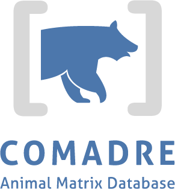

    

#BES 2015 - Edinburgh 14-17 December 2015

Welcome to the workshop on the COMADRE and COMPADRE matrix databases.

These databases together contain several thousand (mostly) published matrix population models (MPMs) for species from across the diverse tree of life.

The purpose of this workshop is to introduce you to the databases and explain their structure and how one can use them to obtain MPMs from particular species of interest, and groups of species for comparative demographic analyses.

## What we'll cover

- Introduction - what are COMADRE and COMPADRE?
- Structure of the database
- What metadata are included?
- Querying the database
- (Starting) a comparative analysis

## Useful links

The COMPADRE and COMADRE website http://www.compadre-db.org (download the latest data files from here)

[COMPADRE User Guide PDF](https://github.com/jonesor/compadreDB/raw/master/COMPADRE-UserGuide/COMPADRE-UserGuide.pdf)

[COMADRE User Guide PDF](https://github.com/jonesor/compadreDB/raw/master/COMADRE-UserGuide/COMADRE-UserGuide.pdf)

[PDFs of Rob's talk from EvoDemoS]()

[PDFs of talk on structure of COMADRE](https://github.com/jonesor/compadreDB/raw/master/Workshop/EvoDemoS2015/COMADRE-Workshop-EvoDemoS-Structure.pdf)

ROpenSci has some very useful R-based tools to link/query databases: https://ropensci.org

e.g. 

`rgbif` -	Access more than 400 million species occurrence records from across the globe in one place, from the Global Biodiversity Information Facility

`taxize` - Get taxonomic identifiers from many different databases; taxonomic synonyms; taxonomic hierarchies; retrieve common names, and more. Access to a dozen different sources

`rcrossref` - An R interface to Crossref metadata search API.